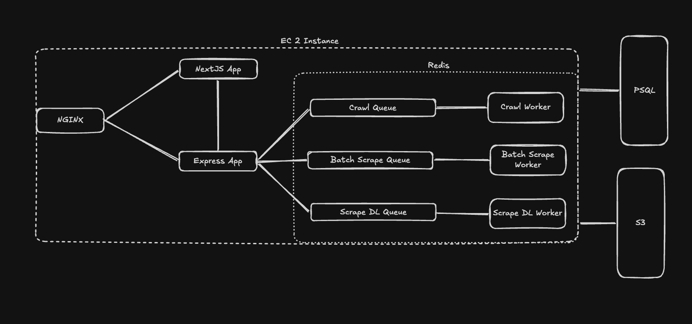

# minicrawl

> minicrawl is a scraper which works on top of browser automation. Currently minicrawl is using [Patchright](https://github.com/Kaliiiiiiiiii-Vinyzu/patchright) to bypass WAFs but I am also working on a separate project [Passright](https://github.com/dwi11harsh/passright/) which will a drop-in replacement for [Patchright](https://github.com/Kaliiiiiiiiii-Vinyzu/patchright).

## Endpoints

### V1

The very first version only scrapes and returns the response. It does not crawl or follow links and neither does it converts raw HTML into any other formats

- POST /scrape - Scrapes a single endpoint and returns raw HTML
- POST /scrape/batch - Scrapes multiple endpoints and returns raw HTML

### V2

- POST /scrape - Scrapes a single endpoint and is capable of returning raw HTML, clean HTML, JSON, or Markdown. It can also server screenshot of the page.
- POST /scrape/batch - Scrapes multiple endpoints and is capable of returning raw HTML, clean HTML, JSON, or Markdown. It can also server screenshot of the page.
- POST /crawl - Crawls a single endpoint and is capable of returning raw HTML, clean HTML, JSON, or Markdown. It can also server screenshot of the page.

### V3 (yet to implement)

- All routes from V2 with same schemas.
- POST /agent - Will scrape/crawl or batch scrape based on the prompt provided by the end user and will be returned a job ID. The agent will use LLM to understand the prompt and decide the best way to scrape/crawl the endpoint.

### Schemas

**Scrape Request**

| Field                   | Data Type                | Default     |
| ----------------------- | ------------------------ | ----------- |
| `url`                   | `string` (URL)           | —           |
| `includeScreenshot`     | `boolean`                | `false`     |
| `includeFullScreenshot` | `boolean`                | `false`     |
| `includeContentInfo`    | `boolean`                | `false`     |
| `includeServerInfo`     | `boolean`                | `false`     |
| `engine`                | `enum: 'browser'`        | `'browser'` |
| `headers`               | `Record<string, string>` | —           |
| `timeout`               | `number`                 | —           |
| `includeMetadata`       | `boolean`                | `false`     |
| `includeLinks`          | `boolean`                | `false`     |
| `includeImageLinks`     | `boolean`                | `false`     |

**Scrape Response**

All responses follow the `MiniResponse` envelope:

| Field | Data Type | Notes |
|---|---|---|
| `success` | `boolean` | `true` if the request succeeded |
| `error` | `string` | Present only on failure |
| `data` | `object` | Payload on success (see below) |

`data` fields:

| Field | Data Type | Notes |
|---|---|---|
| `url` | `string` | The scraped URL |
| `rawHtml` | `string` | Raw HTML of the page |
| `cleanHtml` | `string` | Cleaned HTML (tags stripped) |
| `markdown` | `string` | Page content as Markdown |
| `json` | `object` | Page content as JSON |
| `contentInfo` | `object` | Content metadata |
| `serverInfo` | `object` | Server response metadata |
| `metadata` | `object` | Page metadata (title, description, etc.) |
| `links` | `string[]` | All links found on the page |
| `imageLinks` | `string[]` | All image links found on the page |
| `failedFields` | `string[]` | Fields that could not be extracted |
| `status` | `number` | HTTP status code |
| `screenshot` | `URL` | URL to the viewport screenshot |
| `pdf` | `URL` | URL to the PDF of the page |

> All fields except `url` and `status` are optional and only present when the corresponding `include*` flag was set in the request.

---

**Batch Scrape Request**

| Field | Data Type | Default |
|---|---|---|
| `urls` | `string[]` (URLs) | — |
| `includeScreenshot` | `boolean` | `false` |
| `includeFullScreenshot` | `boolean` | `false` |
| `includeContentInfo` | `boolean` | `false` |
| `includeServerInfo` | `boolean` | `false` |
| `engine` | `enum: 'browser'` | `'browser'` |

---

**Crawl Request**

| Field | Data Type | Default |
|---|---|---|
| `url` | `string` (URL) | — |
| `limit` | `number` (1–200) | `50` |
| `formats` | `enum[]: 'markdown' \| 'json'` | — |
| `onlySameDomain` | `boolean` | `true` |
| `onlySitemap` | `boolean` | `false` |
| `maxDepth` | `number` (1–10) | `5` |
| `ignoreRobotsTxt` | `boolean` | `false` |
| `allowExternalLinks` | `boolean` | `false` |
| `scraperOptions` | `object` (see below) | see below |

`scraperOptions` fields:

| Field | Data Type | Default |
|---|---|---|
| `engine` | `enum: 'browser'` | `'browser'` |
| `includeMarkdown` | `boolean` | `true` |
| `includeMetadata` | `boolean` | `true` |
| `includeLinks` | `boolean` | `true` |
| `includeImageLinks` | `boolean` | `true` |
| `screenshot` | `boolean` | `false` |
| `fullScreenshot` | `boolean` | `false` |
| `includeContentInfo` | `boolean` | `false` |
| `includeServerInfo` | `boolean` | `false` |

---

## Local Deployment

- configure queue options in `packages/redis/src/queue/queue.config.ts, create.ts`, and worker options in `apps/worker/src/woker.config.ts`
